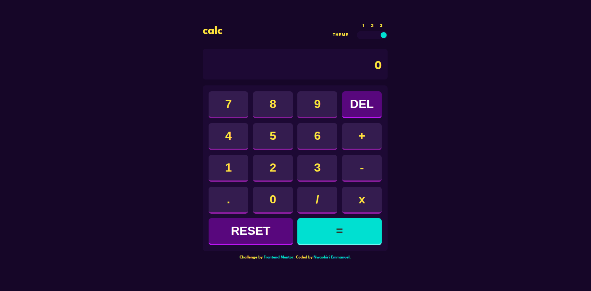

# Frontend Mentor - Calculator app solution

This is a solution to the [Calculator app challenge on Frontend Mentor](https://www.frontendmentor.io/challenges/calculator-app-9lteq5N29). Frontend Mentor challenges help you improve your coding skills by building realistic projects.

## Table of contents

- [Overview](#overview)
  - [The challenge](#the-challenge)
  - [Screenshot](#screenshot)
  - [Links](#links)
- [My process](#my-process)
  - [Built with](#built-with)
  - [What I learned](#what-i-learned)
  - [Continued development](#continued-development)
  - [Useful resources](#useful-resources)
- [Author](#author)
- [Acknowledgments](#acknowledgments)

**Note: Delete this note and update the table of contents based on what sections you keep.**

## Overview

### The challenge

Users should be able to:

- See the size of the elements adjust based on their device's screen size
- Perform mathmatical operations like addition, subtraction, multiplication, and division
- Adjust the color theme based on their preference
- **Bonus**: Have their initial theme preference checked using `prefers-color-scheme` and have any additional changes saved in the browser

### Screenshot



### Links

- Solution URL: [github.com/Emmanuel-Xs/calculator-app-main](https://github.com/Emmanuel-Xs/calculator-app-main)
- Live Site URL: [calculator-app-beta-lemon.vercel.app](https://calculator-app-beta-lemon.vercel.app/)

## My process

### Built with

- **Semantic HTML5 Markup**: For creating a well-structured and accessible foundation.
- **CSS Custom Properties**: Used extensively to create a powerful and easily maintainable multi-theme system.
- **Flexbox & CSS Grid**: For building a robust, responsive layout for the calculator components and keypad.
- **Mobile-First Workflow**: Ensuring the application looks great on all screen sizes.
- **Vanilla JavaScript (ES6+)**: The core logic is built with modern JavaScript, including ES Modules for code organization.
- **[Motion One](https://motion.dev/)**: A lightweight animation library used to create fluid and engaging user interface animations.
- **Web Storage API (`localStorage`)**: To persist the user's selected theme across browser sessions.
- **`prefers-color-scheme` Media Query**: To detect the user's OS-level color scheme preference for the initial theme.

### What I learned

- How to preload fonts to prevent flashes of unstyled text (FOUT)
- How to use `prefers-color-scheme` to detect the user’s OS-level theme preference
- How to use `localStorage` to persist the selected theme across browser sessions
- How to use `motion-one` to create fluid and engaging UI animations
- How to read the user’s theme preference before the page renders to avoid theme-flash issues
- How to separate calculator, theme, and animation logic into dedicated files for better organization and maintainability
- How to use both `flexbox` and `grid` to build a responsive layout for the calculator and keypad
- How to combine CSS custom properties with JavaScript to create a scalable, maintainable multi-theme system
- How to use semantic HTML5 to create a well-structured and accessible foundation

Preload fonts to prevent FOUT.

```html
<link rel="preconnect" href="https://fonts.googleapis.com" />
<link rel="preconnect" href="https://fonts.gstatic.com" crossorigin />
<link
  href="https://fonts.googleapis.com/css2?family=League+Spartan:wght@700&display=swap"
  rel="stylesheet"
/>
<!-- Preload font to improve performance -->
<link
  rel="preload"
  href="https://fonts.gstatic.com/s/leaguespartan/v15/kJEnBuEW6A0lliaV_m88ja5Twtx8BWhtkDVmjZvMGYPZA81d.woff2"
  as="font"
  type="font/woff2"
  crossorigin
/>
```

Using Javascript Modules to separate logic into separate files.

```js
import { initializeCalculator } from "./calculator.js";
import { initializeTheme } from "./theme.js";

initializeTheme();
initializeCalculator();
```

### Continued development

I am looking forward to working with animations, I have come to love it, I really want to get good with it.

### Useful resources

I mostly used AI claude and chatGPT to resolve the issues i have and flesh out the logic as I have it in my head.

## Author

- Frontend Mentor - [Emmanuel-Xs](https://www.frontendmentor.io/profile/Emmanuel-Xs)
- Twitter - [xs_emmanuel](https://x.com/xs_emmanuel)
- GitHub - [Emmanuel-Xs](https://github.com/Emmanuel-Xs)

## Acknowledgments

With the help of AI, this project didn't take as long as I imagined being that I tried to make it as error-proof as I possibly can and also adding animations made it stand out from the rest of the challenge submissions i could find in Frontend Mentor
